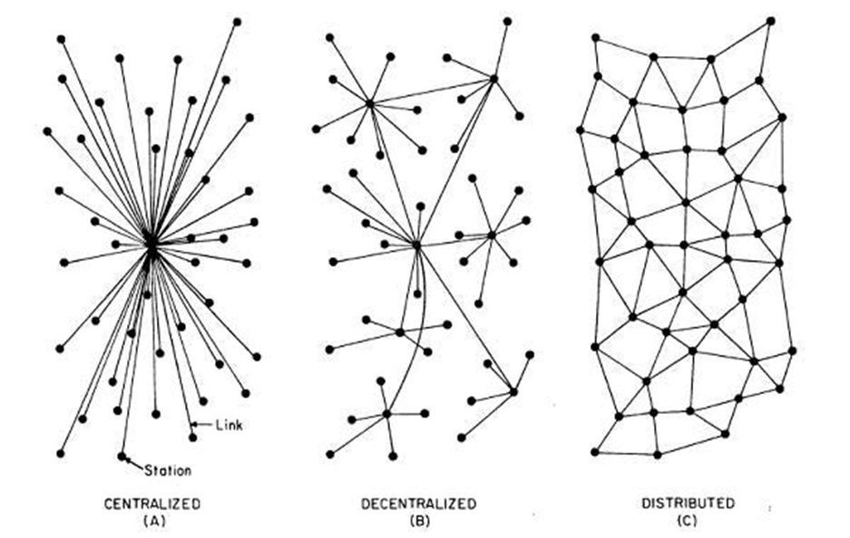

# 01.初识 Git

Git 最初由 Linus Torvalds 创建并开发，现在已成为全球范围内最受欢迎的版本控制工具之一，被广泛用于软件开发、文档编写、网站管理等各种领域。

翻译成人话就是，Git 是现在最受欢迎的分布式版本控制系统，可以说是行业标准，用于跟踪管理代码或者文档，并且它是免费、开源的。

## 分布式

分布式是一种计算机系统的设计方法，它将计算机系统中的不同部分分散在不同的地方，通过网络连接起来，共同协作完成任务。图片中分别展示了集中式、分散式、和分布式三种设计方法的示意图。

- 集中式系统：传统的数据库管理系统，如 Oracle、MySQL 和 Microsoft SQL Server 等，通常使用集中式模型。这些系统将所有数据存储在一个中央服务器上，并且客户端与服务器进行通信以访问和操作数据。另一个例子是源代码管理工具 Perforce，它使用中央服务器来存储代码库并进行版本控制。
- 分布式系统：大规模的分布式计算系统，例如 Apache Hadoop 和 Apache Spark 等，将数据和计算任务分配到多个计算机节点上进行处理。每个节点都可以独立地执行任务，并使用通信协议进行交互。Google 的 MapReduce 框架也是一个分布式系统的示例，它用于处理大规模的数据集。
- 分散式系统：比特币网络是一个分散式系统的典型示例。在比特币网络中，所有节点都是对等的，并且可以独立地处理交易请求。这种模型具有高度冗余性，因为即使其中一个节点失败，整个系统也会继续工作。另一个例子是 IPFS（Inter Planetary File System），它是一个完全去中心化的文件共享协议，用户可以通过该协议安全地共享文件和信息。

## 版本控制系统

版本控制系统是一种可以追踪和管理文件修改历史的工具。

### 为什么需要版本控制系统？

在软件开发过程中，版本控制系统（Version Control System，VCS）是一种非常重要的工具。它可以跟踪代码库中所有文件和目录的历史记录，并允许多个开发人员同时在同一个代码库上工作。下面介绍为什么需要版本控制系统：

1. 历史记录和版本管理：版本控制系统可以记录每次代码提交的变化，并使您能够查看、比较和还原以前的版本。这对于查找错误、测试新功能或回滚更改等任务非常有用。
2. 多人协作：版本控制系统允许多个开发人员同时在同一个代码库上工作，而不会导致冲突或文件覆盖。它可以帮助团队协作，避免代码冲突，并使团队成员能够轻松地共享和审查彼此的更改。
3. 分支和合并：版本控制系统允许创建分支，这些分支可以包含独立的代码变更。这使得开发人员可以同时处理多个问题或尝试新功能，而不影响主要代码库。分支还允许您将单独的更改合并回主代码库，从而将多个代码分支合并为一个整体。
4. 跨平台和备份：版本控制系统可以在不同的操作系统和平台上运行，并且可以轻松地备份代码库以避免数据丢失或损坏。这使得团队成员能够在不同的机器上工作，而不必担心文件同步或版本问题。
5. 可追溯性和审核：版本控制系统可以记录谁做了什么更改，并在需要时提供审计跟踪。这对于保持代码安全、维护产品质量和满足合规要求非常重要。

总之，分布式版本控制系统可以让你轻松地管理你的文档和修改，并且保证你的文件不会丢失或损坏。

最后再重复一遍，Git 是现在最受欢迎的分布式版本控制系统，可以说是行业标准，用于跟踪管理代码或者文档，并且它是免费、开源的。是 IT 从业人员必学的一项技能。