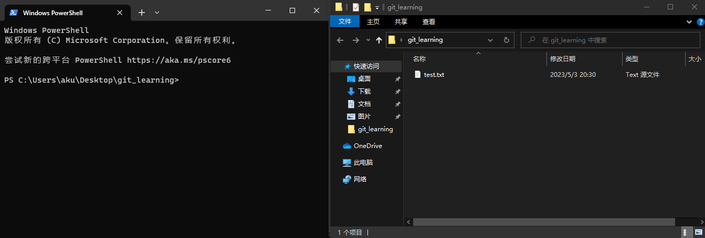

我们在本地新建一个 `git_learning` 的文件夹，创一个 `test.txt` 文件并使用终端打开目录。


## 实验

创建一个本地 Git 仓库，总共分为四步
1. 创建项目文件及文件夹；
2. 使用 git init 命令初始化仓库；
3. 使用 git add 命令，将文件变化信息添加到暂存区；
4. 使用 git commit 命令，将暂存区的修改信息提交到版本库。

```powershell
# 初始化仓库
git init
# 查看仓库状态
git status
# 追踪 test.txt 文件
git add test.txt
# 提交至版本库
git commit -m "Add first file"
```

## 三个区域


这里面涉及到 Git 的三个重要的概念，即工作区、暂存区、版本库。
1. 工作区是指包含项目代码的本地目录，是我们平常在编辑器中修改和操作的目录。比如上节新建的 text.txt 文件。粗暴一点说，除去.git文件及目录就是工作区。
2. 暂存区是用于存储即将被提交到版本库中的文件快照。暂存区实际上是一个文件，它存储在仓库目录下的 .git目录下的 index。Git 会将当前工作目录中已修改的文件的快照存储在暂存区，然后可以通过 git status 命令来查看暂存区和工作目录之间的差异。
3. 版本库是 Git 用来保存项目历史记录的地方，包含了所有的提交记录和文件变更。版本库通常保存在 .git 目录中，包含 Git 对象数据库、分支引用信息、标签引用信息、提交日志等。

### 为什么需要暂存区？

第一次接触到暂存的兄弟，可能会有这样的疑问，我已经完成了文件编辑，直接帮我保存就行了，为什么还要引入暂存的概念呢。
- 首先，我们需要精细化控制，当我们对多个文件进行更改时，我们需要多次审查文件有没有修改正常，如果直接提交，会导致很多问题，引入暂存区，可以让我们在提交前，先预览和审查，然后决定是否上传。不是所有修改过的文件都要上传，假如我们修改过A、B两个文件，B文件没处理完毕，我们可以先上传A文件。也就是部分提交的功能。
- 其次，避免出现误操作，我们将修改和提交分离开，可以很好的控制代码版本，避免更改的文件不会影响到其它部分的文件。
- 最后就是方便协作，在团队协作开发的情况下，使用 Git 暂存区可以避免多人同时修改同一份代码造成的冲突和错误。每个人可以将自己的更改添加到暂存区，并在完成更改后逐一提交。这样可以让每个人更好地管理自己的更改，并及时解决冲突。

## 文件的三个状态

在 Git 中的文件也存在三种状态，已修改、已暂存、已提交。

已修改（modified）：表示文件已被修改但尚未被暂存。我们在工作区修改了文件，并点击了保存，这时候文件状态会变成已修改。也就是说，你已经对文件进行了更改，但还没有使用 `git add`命令将其添加到暂存区域。

已暂存（staged）：表示对一个已修改文件的当前版本做出了标记，以便在下一次提交时将其纳入版本控制。也就是说，使用 `git add` 命令将修改的文件添加到暂存区域中。

已提交（committed）：表示数据已经被安全地保存在本地数据库中。也就是说，在你执行了 `git commit` 命令之后，所有的更改都被保存到了 Git 仓库的历史记录中。

>这里可能有兄弟会有疑问，我们操作的时候，不是有一个未追踪的文件状态存在吗，怎么这里只有三个？
>
>
>
>在 Git 中，已追踪（tracked）和未追踪（untracked）是描述文件或目录状态的概念，与文件的三种状态（已提交、已修改、已暂存)有所不同。一个已追踪文件是受 Git 版本控制管理的文件，即该文件已经被添加到了 Git 数据库中，并且可以使用 `git status` 命令查看其状态。
>
>相反，一个未追踪文件是未被 Git 跟踪的文件，即该文件尚未被添加到 Git 数据库中。通常情况下，如果你使用 `git add` 命令将一个未追踪文件添加到 Git 中，那么该文件就会变成已追踪文件，并且可以被提交和管理。但是，如果你永久地删除了一个已追踪文件，那么它就会变成未追踪文件。在 `git status` 命令输出中，已追踪文件可能有几种不同的状态，包括已修改、已暂存或未被修改。未追踪文件只会在 `git status` 输出中显示一次，并被列为未跟踪文件。

## 看看我们的仓库里有什么？

当我们执行了 `git init` 初始化仓库之后，Git 会创建一个 .git 文件夹，下面是一些文件信息
1.  `HEAD`：指向当前活动分支的指针。
2.  `config`：版本库的配置文件，包括用户名、邮件地址、编辑器等信息。
3.  `description`：用于在 GitWeb 等工具中显示有关版本库的描述信息。
4.  `hooks/`：包含可自定义的 Git 钩子脚本，用于实现特定功能或执行自动化任务。
5.  `objects/`：包含 Git 对象数据库，其中存储了版本库中所有的文件和提交历史记录。
6.  `refs/`：包含分支和标签的指针文件，其中保存了每个分支和标签及其所指向的提交 ID。
7.  `index`：暂存区的索引文件，用于记录下一次提交要包括的文件。