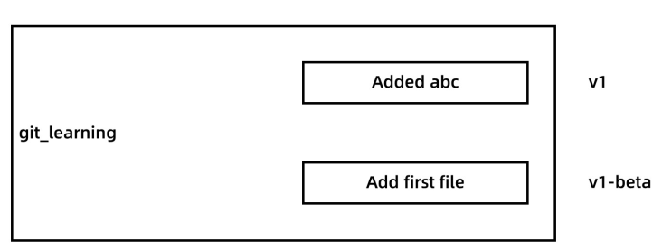

# 11.标签操作

在 Git 中，标签是一种用于为代码库中的特定版本打上标记的方法。它通常用于标记软件的重要版本，以便用户或开发人员更容易地识别和访问它们。

## 打标签

下面进行操作，Git 提供了`tag` 命令，使用 `git tag`加上标签名字，比如使用 `git tag v1` 即可命名当前版本为 v1 版本。在操作前，请确认你所在的分支。

```powershell
# 查看状态
$ git status

# 如果不在主分支，切换至主分支
$ git checkout master

```

将最新提交打上标签 v1，将第一次提交打上标签 v1-beta



```powershell
# 把最新一次提交标记为 v1
$ git tag v1

# 查看提交信息
$ git hist
* d7f681f 2023-05-05 | Added abc to the test.txt (HEAD -> master) [aku]
* 01b8702 2023-05-05 | Add first file [aku]
```

上节我们聊到切换版本，使用的是哈希值去定位，我们现在可以用标签去定位，比如我们现在想回到v1版本的上一个版本(v1的父级)，也就是我们的第一次提交，并打上一个标签 v1-beta。

可以进行如下操作，

```powershell
# 切换至 v1 的父级
$ git checkout v1^
  ...
  HEAD is now at bc0c3f0 Add first file

# 打上标记
$ git tag v1-beta

# 显示当前可用的标签
$ git tag
v1
v1-beta

# 显示所有分支的提交历史记录。
$ git hist master --all
* d7f681f 2023-05-05 | Added abc to the test.txt (tag: v1, master) [aku]
* 01b8702 2023-05-05 | Add first file (HEAD, tag: v1-beta) [aku]

```

在 Git 中，`^` 符号 (carrot) 表示引用前一个提交。它可以与分支名、标签名或者提交 SHA-1 值一起使用，并指示 Git 跳过该提交的父提交，以便获取更早的提交。

下面是一些常见的在 Git 中使用 `^` 符号的示例：

- `HEAD^`：引用当前提交的父提交。
- `master^`：引用 master 分支上最新提交的父提交。
- `v1.0^`：引用 v1.0 标签所指向的提交的父提交。
- `abc123^`：引用 SHA-1 值为 abc123 的提交的父提交。

除了单个 `^` 符号外，还可以使用多个 `^` 符号来引用更早的提交。例如，`HEAD^^` 表示当前提交的父提交的父提交，即当前提交之前的第二个提交。

此外，在提交历史中，一个提交通常有多个父提交（例如合并操作），这时 `^` 符号就不够用了。可以使用 `~` 符号来引用更远的祖先提交。例如，`HEAD~3` 表示当前提交之前的第三个提交，而 `HEAD~2^2` 则表示当前提交的第二个父提交的父提交。
`^` 符号在 Git 中用于引用前一个提交，它可以与分支名、标签名或者提交 SHA-1 值一起使用，以获取更早的提交。

## 删除标签

删除标签使用`-d` 选项参数

```powershell
git tag -d v1
```

## 添加标签信息

`-a` 选项参数表示创建一个带注释的标签；
`v1` 表示标签的名称；
`-m "Version 1.0 release"` 则表示对该标签的注释信息。

```powershell
$ git tag -a v1 -m "Version 1"

# 查看详细内容
$ git show v1
tag v1
Tagger: aku <aku@example.com>
Date:   Fri May 5 19:15:39 2023 -0700

Version 1

commit d7f681fa3086bfa0222388775c827ab650e00a16 (HEAD -> master, tag: v1)
Author: aku <aku@example.com>
Date:   Fri May 5 19:05:08 2023 -0700

    Added abc to the test.txt

diff --git a/test.txt b/test.txt
index e69de29..f2ba8f8 100644
--- a/test.txt
+++ b/test.txt
@@ -0,0 +1 @@
+abc
\ No newline at end of file
```
