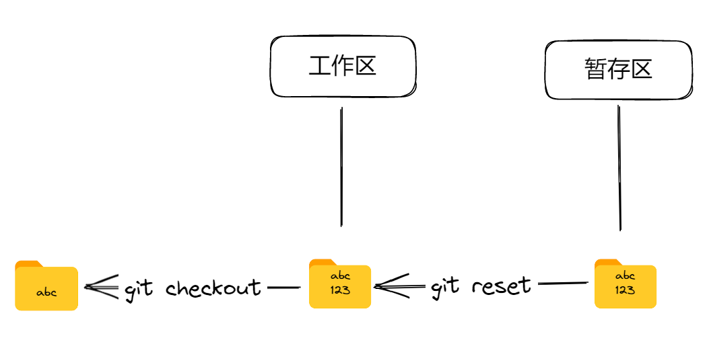

# 13.撤销修改-已暂存状态下



本节将学习撤销已暂存的状态，也就是我们更改了文件，并且使用 `git add` 命令，将更改提交到了暂存区。现在需要撤销已暂存的状态使用 `git status` 查看状态。我们输入 `git checkout master`，切换到主分支。

## 修改文件，并提交至暂存区

在 test 文件中添加一行 123，并保存。使用 `git add` 命令提交至暂存区。

```powershell
# 查看文件内容
$ cat .\test.txt
abc
123

# 添加到暂存区
$ git add test.txt

# 查看状态
$ git status
On branch master
Changes to be committed:
  (use "git restore --staged <file>..." to unstage)
        modified:   test.txt
```

## 重置暂存区

现在我们尝试撤销操作，未提交的文件恢复命令使用的是 reset 命令，我们输入 `git reset HEAD test.txt` ，将文件移除暂存区。

```powershell
# 撤销暂存文件 
$ git reset HEAD test.txt
Unstaged changes after reset:
M       test.txt

# 查看状态
$ git status
On branch master
Changes not staged for commit:
  (use "git add <file>..." to update what will be committed)
  (use "git restore <file>..." to discard changes in working directory)
        modified:   test.txt

no changes added to commit (use "git add" and/or "git commit -a")
```

HEAD 是一个指针，它指向当前分支所在的提交。换句话说，它是指向当前工作目录所基于的最新提交的引用。在此处 HEAD 参数也可以省略。

## 恢复本地修改

现在要恢复文件状态，我们还得执行 [12.撤销修改-本地已保存状态](12.%E6%92%A4%E9%94%80%E4%BF%AE%E6%94%B9-%E6%9C%AC%E5%9C%B0%E5%B7%B2%E4%BF%9D%E5%AD%98%E7%8A%B6%E6%80%81.md)中的操作

```powershell
# 撤销暂存前更改
$ git checkout test.txt

# 查看 Git 状态
$ git status
git status
On branch master
nothing to commit, working tree clean
```

## reset 和 checkout

`reset` 和 `checkout` 是 Git 中两个常用的命令，它们都可以用于将 HEAD 指针移动到其他提交或分支上。然而，它们之间有一些重要的区别：

- `reset` 命令改变了当前分支的历史记录，并可以影响暂存区和工作目录的状态。例如，使用 `git reset --hard <commit-SHA>` 命令将会重置当前分支的历史记录并强制更新工作目录和暂存区以匹配指定的提交。
- `checkout` 命令则是切换到不同的分支或提交，但不会更改当前分支的历史记录。例如，使用 `git checkout <branch-name>` 命令将会切换到指定的分支，并将 HEAD 指针移到该分支的最新提交上。

因此，在进行 Git 操作时，请根据您的需要选择正确的命令。如果您想要撤销某些更改并将历史记录回滚到旧的提交，则应使用 `reset` 命令。如果您只是想查看其他提交的状态或切换到不同的分支，则应使用 `checkout` 命令。

请注意，在使用这些命令之前，请务必先备份您的代码库并确保已经理解了命令所带来的影响。不正确使用这些命令可能会导致数据丢失或代码库处于不稳定状态。
